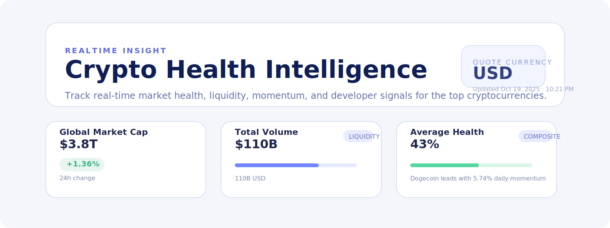
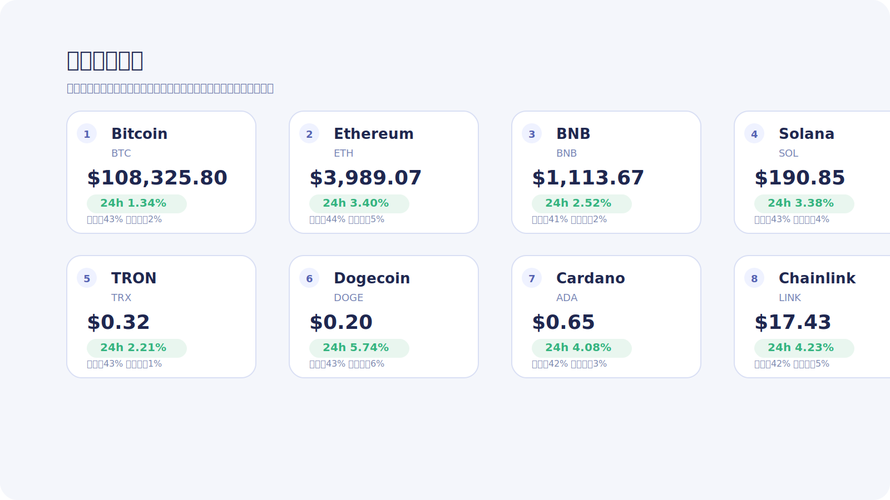
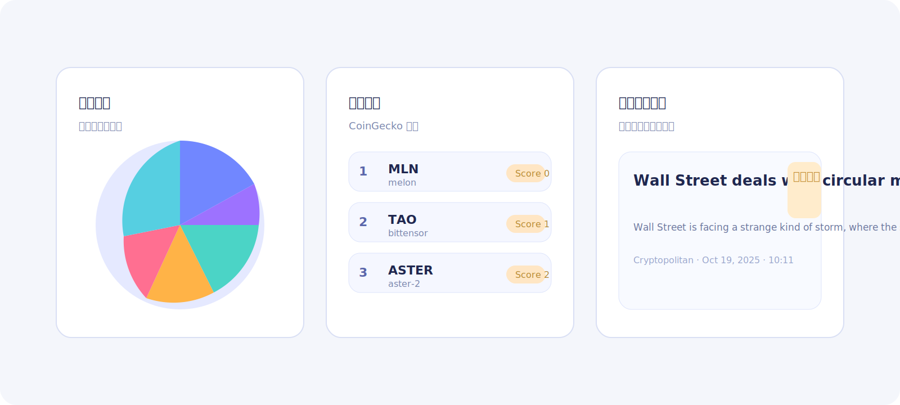
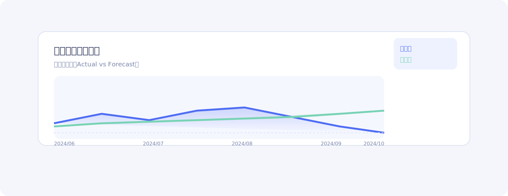

# Crypto Health Intelligence Dashboard

可视化虚拟货币的关键金融指标、健康评分以及趋势走向的全栈站点。后端基于 Node.js + Express 聚合 CoinGecko 数据并计算多维健康指标，前端采用 React + Vite + Recharts 构建互动式分析界面，支持多种维度的实时刷新。

## 功能总览
- **实时市场聚合**：获取主流币种的价格、成交量、市值、占比等信息，并按分钟级缓存减轻 API 压力。
- **健康评分模型**：综合波动率、流动性、动量、开发活跃度及社区影响力生成 0-100 的健康评分。
- **可视化总览 + 专业详情页**：首页展示核心币种卡片和市场概览，点击任意币种即可进入金融视角的单币分析页面。
- **多维图表**：包括趋势折线图、指标雷达图、指标对比柱状图、市场占比饼图及 7 天迷你走势图等。
- **交互筛选与订阅**：支持切换计价货币、选择不同时间窗口，并可订阅邮箱定期接收行情摘要和预测。
- **后台管理页**：管理员登录后可在线配置 SMTP、开启/关闭邮件推送并查看订阅用户列表。

## 目录结构
```
.
├── backend      # TypeScript + Express API 服务
├── frontend     # Vite + React 可视化前端
└── README.md    # 项目说明
```

## 环境要求
- Node.js ≥ 20.19（Vite 官方要求，建议使用 `nvm use 20`）
- npm ≥ 10

> 说明：在 Node 18 下也能编译运行，但会有 engine warning。推荐升级以保证长期兼容性。

## 快速一键启动

```bash
./start.sh
```

脚本会自动：
- 创建/更新后端虚拟环境并安装依赖；
- 以指定端口（默认 14000）启动 Flask API；
- 安装前端依赖并运行 Vite 开发服务器（默认 5173）；
- 输出访问地址，`Ctrl+C` 可同时关闭前后端。

可通过环境变量定制：

| 变量 | 说明 | 默认 |
| ---- | ---- | ---- |
| `BACKEND_PORT` | 后端监听端口 | `14000` |
| `FRONTEND_PORT` | 前端监听端口 | `5173` |
| `API_BASE_URL` | 前端访问的后端地址 | `http://127.0.0.1:<BACKEND_PORT>` |

日志保存在 `/tmp/backend_run.log`、`/tmp/frontend_run.log`，依赖安装日志存于 `/tmp/backend_pip_install.log` 与 `/tmp/frontend_npm_install.log`。

## 后端部署
```bash
cd backend
cp .env.example .env          # 如需自定义端口或默认币种
npm install
npm run dev                   # 开发模式（使用 ts-node + nodemon）
# 或
npm run build && npm start    # 生产构建并运行
```

主要环境变量（`.env`）：
- `PORT`：API 服务端口，默认 `14000`
- `DEFAULT_COINS`：默认追踪的币种 ID 列表（逗号分隔）
- `DEFAULT_VS_CURRENCY`：默认计价货币，默认 `usd`
- `CACHE_TTL_SECONDS`：CoinGecko 响应的缓存时间
- `MAX_COINS_PER_REQUEST`：单次请求最大币种数量
- `POLICY_NEWS_ENDPOINT`（可选）：自定义金融政策资讯数据源，默认使用 CryptoCompare Regulation 新闻接口
- `DATABASE_PATH`：订阅用户信息的 SQLite 存储路径（默认 `./data/app.sqlite3`）
- `EMAIL_ENABLED`：是否启用邮件推送功能（`true/false`）
- `SMTP_HOST`/`SMTP_PORT`/`SMTP_USERNAME`/`SMTP_PASSWORD`/`SMTP_FROM_EMAIL`：邮件推送所需的 SMTP 配置
- `ADMIN_PASSWORD`：后台管理登录密码
- `ADMIN_JWT_SECRET`：后台签发 JWT 的密钥

### API Endpoints
| 方法 | 路径 | 描述 |
| ---- | ---- | ---- |
| GET | `/healthz` | 健康检查 |
| GET | `/api/coins` | 带健康指标的币种列表，可指定 `ids`、`vs_currency` |
| GET | `/api/coins/:id/history` | 指定币种历史数据，支持 `timeframe`（1D/7D/30D/90D/1Y）和 `vs_currency` |
| GET | `/api/market/overview` | 市场总览：总市值、成交量、占比、热门搜索 |
| GET | `/api/news/policies` | 金融/监管政策资讯（默认接入 CryptoCompare Regulation 新闻，可自定义数据源） |
| GET | `/api/macro/nfp` | 美国非农就业数据（示例数据，支持替换为真实来源） |
| POST | `/api/users/subscriptions` | 新增/更新邮箱订阅（参数：`email`、`coins` 数组） |
| GET | `/api/users/subscriptions/{email}` | 查询指定邮箱的订阅信息 |
| POST | `/api/admin/login` | 管理员登录，参数 `password`，返回 Bearer Token |
| GET/PUT | `/api/admin/config` | 获取/更新邮件推送等配置（需 Bearer Token） |
| GET | `/api/admin/subscribers` | 查看所有订阅邮箱（需 Bearer Token） |

## 前端部署
```bash
cd frontend
cp .env.example .env          # 设置后端 API 地址，默认为 http://localhost:14000
npm install
npm run dev                   # 启动本地开发（默认 5173 端口）
# 或
npm run build && npm run preview
```

前端 `.env` 变量：
- `VITE_API_BASE_URL`：后端地址，开发模式通常为 `http://localhost:14000`

## 可视化面板
- **Overview**：展示全球市值、总成交量、平均健康度及领先币种。
- **Price & Volume**：支持 1 天至 1 年的价格/成交量联动趋势图。
- **Health Radar**：单个币种的多维健康指标雷达图。
- **Metric Comparison**：多个币种的健康、流动性、动量、波动性柱状对比。
- **Dominance & Trending**：市占率饼图与 CoinGecko 热门币种列表。
- **Tracked Assets Table**：主表格包含价格、24h 涨跌、成交量、健康进度条和 7 日迷你图，可点击切换关注对象。

## 后续可拓展方向
1. **WebSocket 或 SSE** 实现秒级推送，减少轮询开销。
2. **用户偏好与自定义分组**，支持本地存储或账号体系。
3. **更多数据源**（链上数据、期权隐含波动率等）丰富健康模型。
4. **部署脚本**：提供 Dockerfile 与 CI 工作流，快捷部署到云端。

欢迎根据业务需求进行二次开发，或将健康评分模型与自有策略结合使用。

## 页面预览

| 首页仪表盘 | 核心币种概览 |
| --- | --- |
|  |  |

| 市场洞察 | 美国非农就业数据 |
| --- | --- |
|  |  |

## 邮件订阅与推送

1. 在 `backend/.env` 中配置 SMTP 相关变量，并将 `EMAIL_ENABLED` 设置为 `true`。
2. 调用订阅接口（示例）：
   ```bash
   curl -X POST http://127.0.0.1:14000/api/users/subscriptions \
     -H "Content-Type: application/json" \
     -d '{"email": "user@example.com", "coins": ["bitcoin", "ethereum"]}'
   ```
3. 运行 `python send_notifications.py`（位于 `backend/` 目录）即可向所有订阅者发送当日摘要，可结合系统 `cron` 定时执行。

## 后台管理页面

1. 在 `.env` 中配置 `ADMIN_PASSWORD` 与 `ADMIN_JWT_SECRET`。
2. 访问前端 `http://127.0.0.1:15173/admin`，输入管理员密码登录。
3. 登录成功后可在线修改 SMTP 配置、开启/关闭邮件推送、查看订阅用户列表。
4. 所有请求均通过受保护的后台 API 下发或写入 SQLite，确保配置实时生效。

> 默认证书：如未修改 `.env`，可使用 `admin123` 登录后台。
